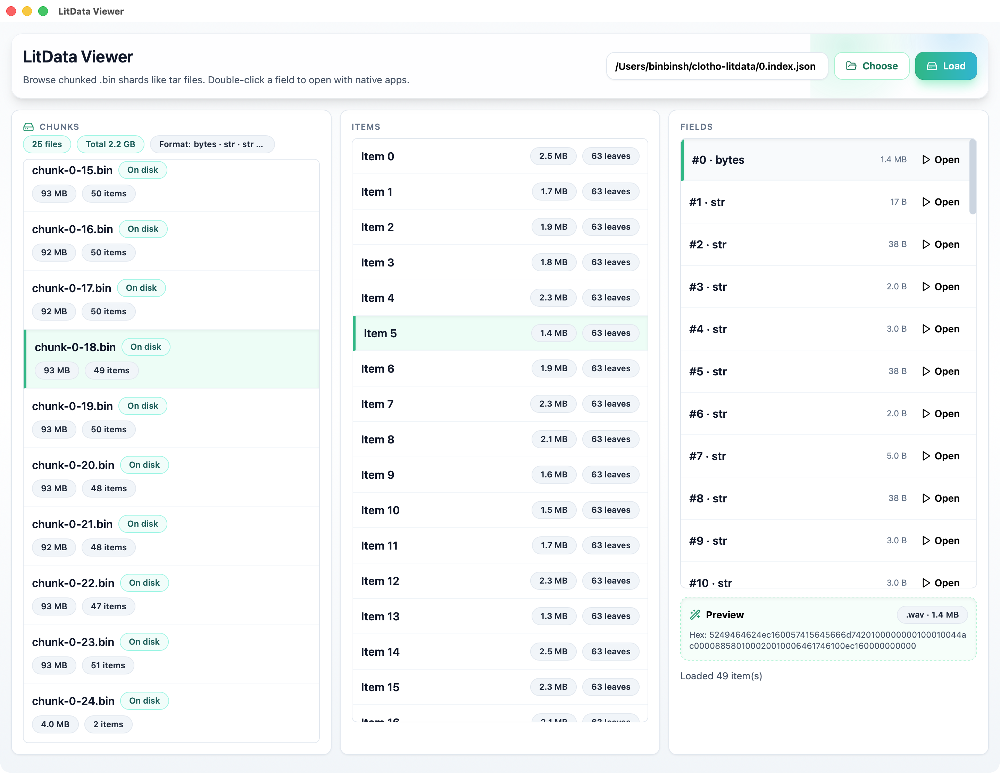

  

<h1 align="center">LitData Viewer</h1>

  
  
  

## About
LitData Viewer is a desktop UI for browsing [Lightning-AI/litData](https://github.com/Lightning-AI/litData) chunked `.bin` shards and inspecting fields.

  

## Usage
1. Download installers/bundles: https://github.com/binbinsh/litdata-viewer/releases
2. Click **Choose** to select an `index.json` or chunk `.bin/.zst` file, then press **Load**.
3. Pick a chunk → item → field; double-click a field (or hit **Open**) to write a temp file and launch it with your default app.
4. Preview pane shows text or a hex snippet; statuses/errors appear below.
5. Report issues/feature requests: https://github.com/binbinsh/litdata-viewer/issues

## Development
- **Install deps:** `npm install` (Node 20+ recommended).
- **Dev (web + Tauri):** `npm run tauri dev` (starts Next.js and opens the Tauri window).
- **Build web export:** `npm run build` (outputs static site to `out/`).
- **Build desktop app:** `npm run tauri build` (creates platform installer/bundle).

